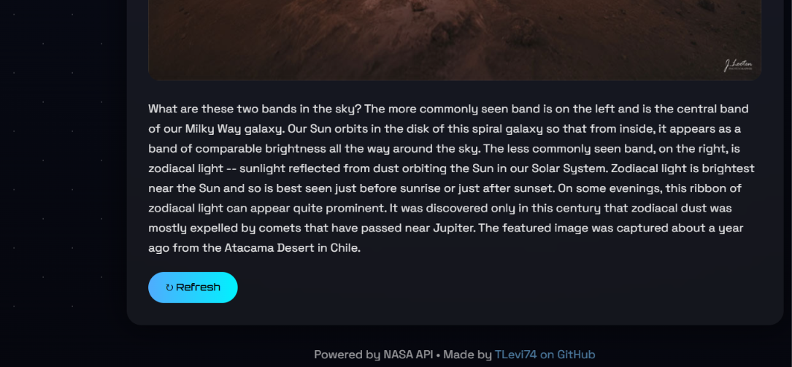

````md
# NASA Astronomy Picture of the Day

A responsive web application that displays NASA's **Astronomy Picture of the Day (APOD)** using NASA's public API. The site automatically fetches and displays a new image or video every day, along with its title and description.



## Features

- 🌌 Fetches data from NASA's APOD API
- 🖼️ Displays the daily astronomy image or video
- 📝 Shows the title, date, and explanation
- 🔄 Refresh button to reload the latest data
- ⚠️ Error handling for failed API requests
- 🎨 Custom glassmorphism UI with animations
- ⭐ Animated star background
- 📱 Fully responsive design
- 🔗 Footer with GitHub profile link

## Built With

- HTML
- CSS
- JavaScript
- NASA APOD API

## Demo

You can view the live website here:

```text
https://tlevi74.github.io/nasatest/
```

## Project Structure

```text
nasa-apod/
│
├── index.html
├── style.css
├── script.js
└── README.md
```

## What I Learned

- Working with external APIs using `fetch()`
- Handling asynchronous JavaScript with `async/await`
- Creating responsive layouts
- Adding animations

## Author

Made by **TLevi74**

GitHub: https://github.com/TLevi74

---

Data provided by NASA Astronomy Picture of the Day API
````
